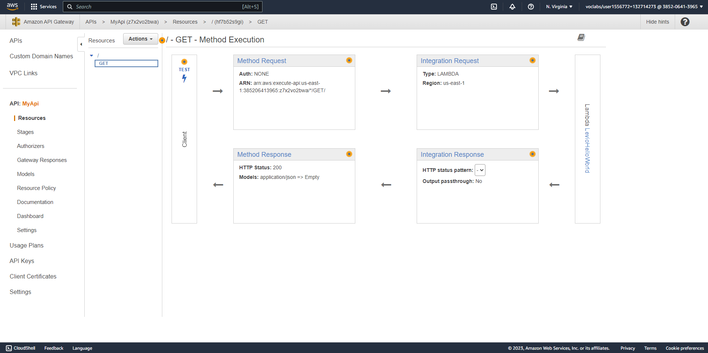

# Hello world with AWS Lambda

This starter project consists of:
* Function.cs - class file containing a class with a single function handler method
* aws-lambda-tools-defaults.json - default argument settings for use with Visual Studio and command line deployment tools for AWS

## Getting Started

1. Clone this repository
2. [Create aws account](https://aws.amazon.com/free)
3. [Setup the AWS cli locally](https://docs.aws.amazon.com/cli/latest/userguide/cli-chap-getting-started.html)
4. [Install dotnet 6](https://dotnet.microsoft.com/en-us/download)
5. Install Amazon.Lambda.Tools Global Tools.
```
    dotnet tool install -g Amazon.Lambda.Tools
```
6. Deploy function to AWS Lambda
```
    dotnet lambda deploy-function
```

## Output

1. Screenshot of the deploy command output
   
2. Screenshot of the API Gateway
   
   
3. Screenshot of the AWS Lambda logs on CloudWatch
   
4. Screenshot of invoking the endpoint
   
   